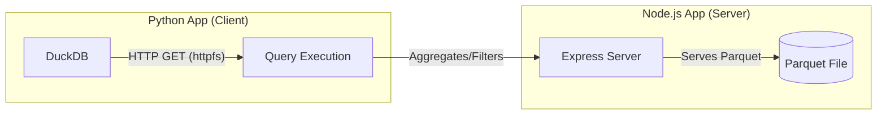

# DuckDB Polyglot Project 🦆

[](https://opensource.org/licenses/ISC)
[](https://www.python.org/downloads/)
[](https://nodejs.org/)
[](https://duckdb.org/)

A demonstration of a **polyglot architecture** (Node.js + Python) leveraging **DuckDB**'s powerful `httpfs` extension to query remote Parquet files served over HTTP.

## 🏗️ Architecture

The project consists of two main components:

1.  **Node.js App (`node-app`)**: An Express server that hosts and serves a Parquet dataset (`netflix_daily_top_10.parquet`).
2.  **Python App (`python-app`)**: A data processing script that uses DuckDB to remotely query the data from the Node.js server without downloading the entire file.



## 🚀 Getting Started

### Prerequisites

- [pnpm](https://pnpm.io/) (for Node.js dependencies)
- [uv](https://docs.astral.sh/uv/) (recommended for Python environment management)

### Setup & Running

#### 1. Start the Node.js Server

The server hosts the data on `http://localhost:3000/get-data`.

```bash
cd node-app
pnpm install
pnpm run dev
```

#### 2. Run the Python Query

The Python script connects to the local server and executes a DuckDB query.

```bash
cd python-app
uv sync
uv run main.py
```

## 📊 Features

- **Zero-Copy Remote Querying**: Use `httpfs` to query Parquet files directly over HTTP.
- **In-Memory Analytics**: DuckDB provides lightning-fast analytical queries.
- **Microservices-ready**: Demonstrates a clean separation between data provider (Node) and data consumer (Python).

## 📄 License

This project is licensed under the ISC License.
